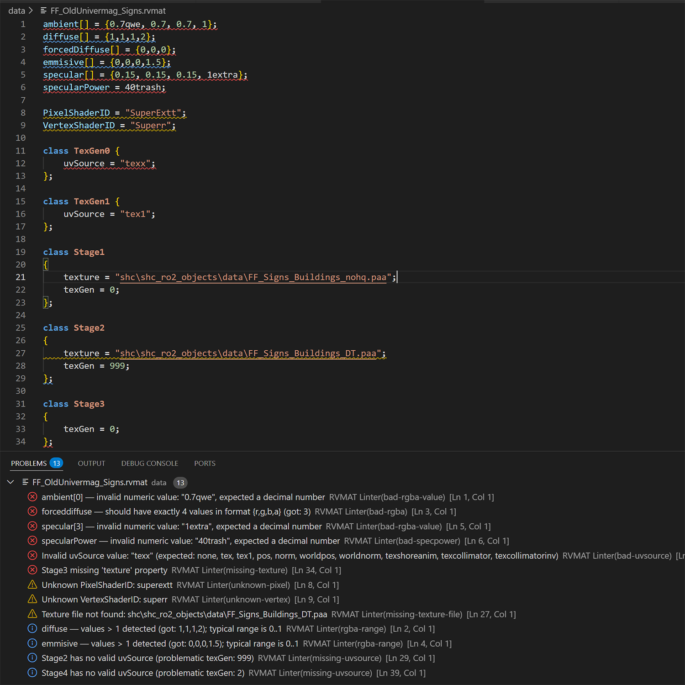
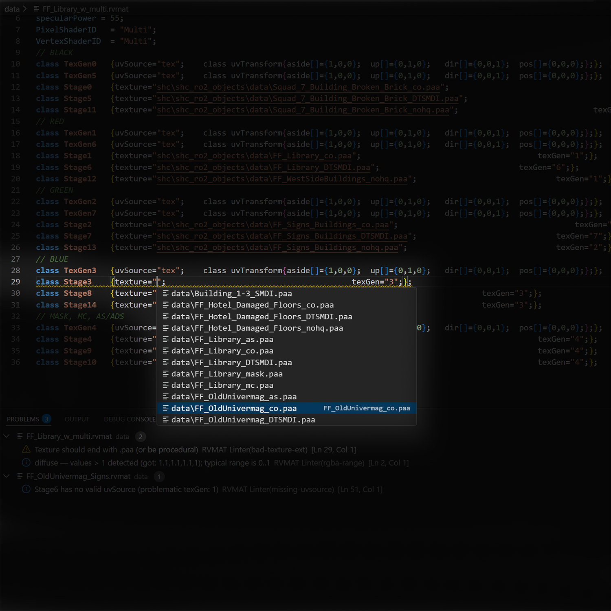
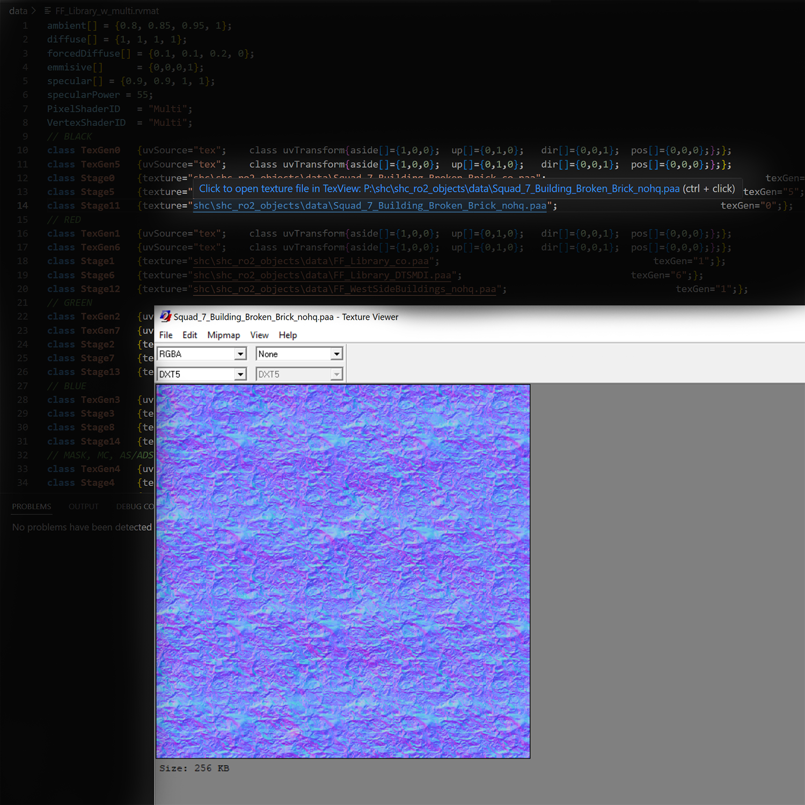

# RVMAT Tools

Syntax highlighting, linting, autocompletion and TexView integration for Arma 3 .rvmat material files.

## Features

- Full syntax highlighting for .rvmat
- Linting: unknown shaders, invalid uvSource, missing texture, bad RGBA values, trash after ;
- Autocompletion for PixelShaderID, uvSource, renderFlags, texture paths, texGen references
- Quick open texture with TexView (context menu + command)
- Texture existence check (optional)
- Support for P: drive paths

## Commands

- **RVMAT: Open Texture with TexView** — open selected texture in TexView2
- **RVMAT: Validate Current File** — manual linting

## Settings

- `rvmat-linter.texViewPath` — path to TexView.exe
- `rvmat-linter.checkTextures` — enable/disable texture file check
- `rvmat-linter.pDriveRoot` — custom P: drive root (default: P:\\)

## Screenshots

## Installation

Install from VS Code Marketplace: [RVMAT Tools](https://marketplace.visualstudio.com/items?itemName=arma-community.rvmat-tools)

## License

MIT